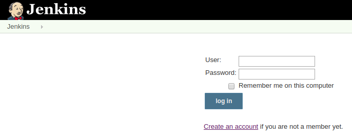

Ansible Role: osm_jenkins
=========
An ansible role to install and configure jenkins server.

Version History
---------------

|**Date**| **Version**| **Description**| **Changed By** |
|----------|---------|---------------|-----------------|
|**June '15** | v.1.0 | Initial Draft | Sudipt Sharma |

Salient Features
----------------
* This role will fetch and install latest jenkins version available in repository but if you want to install a specific veriosn you may pass it in variables. 

Supported OS
------------
  * CentOS:7
  * CentOS:6
  * Ubuntu:bionic
  * Ubuntu:xenial

Dependencies
------------
* Java {version 8 preferred}

Requirements
------------
* curl
* libselinux-python
* initscripts
* apt-transport-https

Role Variables
--------------

|**Variables**| **Default Values**| **Description**|
|----------|---------|---------------|
| jenkins_admin_username | admin | Username of Admin |
| jenkins_admin_password | admin | Password for Admin user|
| jenkins_connection_delay | 5 | Wait for Jenkins to start up before proceeding |
| jenkins_connection_retries | 60| Retry to execute task if it fails to start Jenkins |
| jenkins_home | /var/lib/jenkins | Home Directory of jenkins|
| jenkins_hostname | localhost| Hostname for Jenkins |
| jenkins_http_port | 8080 | Port on which Jenkins runs|
| jenkins_jar_location | /opt/jenkins-cli.jar | Location where jar file for jenkins stores|
| jenkins_url_prefix | ""| URL prefix used in jenkins url|
| jenkins_java_options | "-Djenkins.install.runSetupWizard=false" | |
| jenkins_plugins| ['git']| Plugins add in Jenkins|
| jenkins_plugins_state | present | Jenkins plugin state|
| jenkins_plugin_updates_expiration | 86400 | Number of seconds after which a new copy of the update-center.json file is downloaded|
| jenkins_plugin_timeout | 300 | Jenkins Server connection timeout in secs|
| jenkins_plugins_install_dependencies | yes | Defines whether to install plugin dependencies. |
| jenkins_process_user | jenkins | Jenkins process username|
| jenkins_process_group | "{{ jenkins_process_user }}" | Jenkins process groupname|


Inventory
----------
An inventory should look like this for galera cluster:-
```ini
[jenkinshost]                 
192.168.1.198    ansible_user=ubuntu   
192.168.3.201    ansible_user=opstree 
```

Example Playbook
----------------

* Here is an example playbook:-

```sh
---
- hosts: jenkinshost
  become: yes
  roles:
    - jenkins

```
* ansible-playbook site.yml --vault-password-file vault_secret.sh
> vault_secret.sh is a simple script with single echo statement as: echo $password, where $password will be used to decrypt variables file: vars/adminpass.yml containing jenkins admin user login credentials.

* Password for decrypting vars/adminpass.yml for this role is: OcCeybCiWist3

Plugins
-------
* By default it will install 'git' but you may pass more plugins in the list in defualts/main.yml playbook 

After the successful installation of jenkins, browse through the jenkins url and you would get your login page




References
----------
- **[software](https://jenkins.io/)**

Author Information
------------------

- Yashvinder Hooda
- yashvinder.hooda@opstree.com
